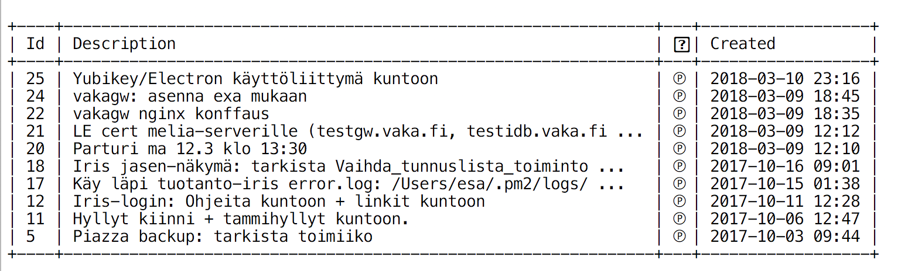

Tedo
=========

__Terminal Todo__

----

File storage: default `~/.tedo.json`

__Usage:__

```
$ go run ./tedo.go h

    Name:          tedo (Terminal Todo)
    -------        ----------------------
    $ tedo         Show all tasks
    $ tedo p       Show all pending tasks
    $ tedo s ID    Show detail view task of ID
    $ tedo a       Add a new task
    $ tedo m ID    Modify a task
    $ tedo rm ID   Remove task of ID from list
    $ tedo del     Remove latest task from list
    $ tedo c ID    Mark task of ID as completed
    $ tedo p ID    Mark task of ID as pending
    $ tedo flush   Flush the database!

```

----

Screenshot: 



__License__ :

[MIT License](LICENSE.md).